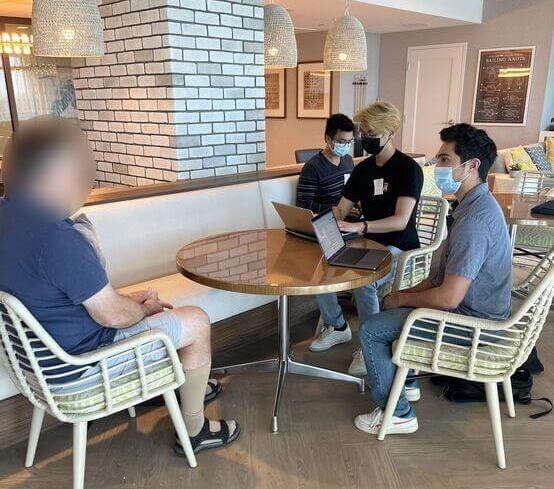

### Project Team: [Yash Potdar](https://www.linkedin.com/in/yashmpotdar/), [Kenneth Nguyen](https://www.linkedin.com/in/kenneth-nguyen-81520/), [Josh Wang](https://www.linkedin.com/in/qiaoxuan-wang/)
### Timeline: 8 weeks
### Role: User Research, Wireframing, User Testing, Low- and High-Fidelity Prototyping
### Tools: Figma, Lucidchart
---
---

# Background

## Our Mission
Our team aims to redesign Facebook to be centered around communication and community-building and have better accessibility for senior citizens. We have identified a problem that individuals in the 65+ community need a more streamlined way to find communities in their local sphere in order to foster new relationships and engage with others in social settings. 

## Our Motivation (and my Personal Motivation)
Individuals in the 65+ community face mental health issues at alarmingly high rates. Mental health among senior citizens is a big issue, as around 20% of individuals aged 55 or older have mental health problems as estimated by the  <a href="https://www.cdc.gov/aging/pdf/mental_health.pdf" target="_blank">CDC</a>. In fact, senior males have the highest rate of suicide among any other age group, and this may be due to depression or anxiety relating to aging and lack of motivation and fulfillment. Senior citizens are also more likely than other age groups to report that they “rarely” or “never” received the social and emotional support they needed. 

In my case, I definitely witnessed my grandparents in India could not be as mobile as they used to, and would be lonely and bored throughout the days. Being in a different country than their grandchildren was definitely difficult for their mental health. 

## Target Audience
Our case study was centered around the 65+ community. We plan to add our redesign as an opt-in interface that is catered towards our target audience and would not impede other users if they prefer the current UI.

## Our Objectives
* Ensure that seniors are able to join communities that align with their interests.
* Ensure that seniors have a streamlined experience when contacting their closest friends and loved ones.
* Allow seniors to easily find events that align with their hobbies.
* Reduce the learning curve of Facebook and highlight essential features desired by seniors.
* Reduce sentiments of alienation and increase fulfillment within the 65+ community.

# User Research
We performed user research to witness firsthand how senior citizens use Facebook. This would include the device they use, the features they use, and the time spent on Facebook. By understanding their experience, we would be able to better identify challenges they face and areas within Facebook we can improve.

We conducted initial user interviews throughout the span of one week in-person and on Zoom at Belmont Village Senior Living La Jolla. We created this flyer and worked with the manager at Belmont Village to work with members of the community.

## Research Methods
We employed a mixed-methods approach to identify the relationship seniors have with Facebook:

* **Interviews**: 
    * Gain a general idea of how users interact with the app
    * Understand users' past experiences with the app
* **Direct Observation**: 
    * Gain a clear, unbiased idea of how seniors naturally interact with Facebook
    * Identify breakdowns, which are opportunities for us to fill in the gaps

## Research Findings
* Seniors **do not** use Facebook to make new friends. They prefer face-to-face interactions to virtual interactions.

"I am at the stage of life where I am not seeking to meet new people."

"I'm more of a one-on-one person. I can't say I've made any friends on social media."

* Seniors mainly use Facebook to keep in touch with loved ones and reconnect with old friends.

"Facebook has made my relationships stronger and better, as well as more frequent."

"I use Facebook to find my friends from my former life."

* Seniors are open to joining groups or communities based on similar interests or beliefs as long as they as accessible for seniors.

* **Pain Point**: Facebook's excess of features feels overwhelming. If Facebook was not already a part of their lives, it would be very challenging to convince them to use it and overcome the learning curve.

# User Personas

# High-Fidelity Prototypes

# Reflection

fdsf