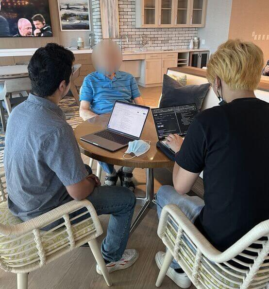
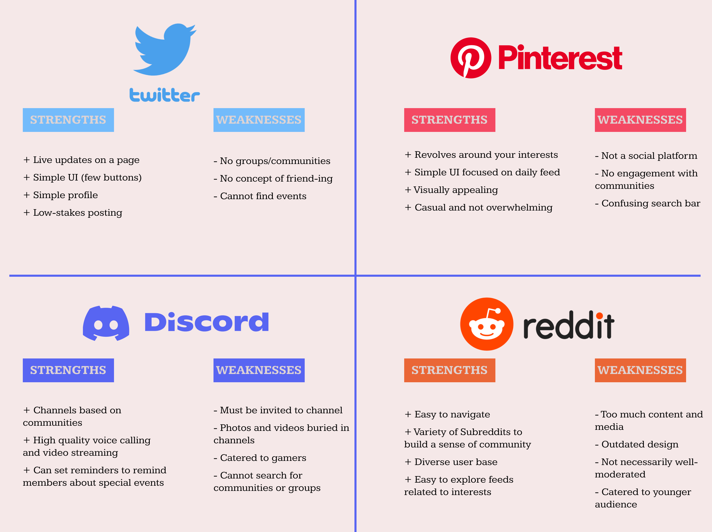

### Project Team: <a href="https://www.linkedin.com/in/yashmpotdar/" target="_blank">Yash Potdar</a> , <a href="https://www.linkedin.com/in/kenneth-nguyen-81520/" target="_blank">Kenneth Nguyen</a> , <a href="https://www.linkedin.com/in/qiaoxuan-wang/" target="_blank">Josh Wang</a>

### Timeline: 8 weeks
### Role: User Research , Wireframing , User Testing , Low- and High-Fidelity Prototyping
### Tools: Figma , Lucidchart
---
---

# Background

## Our Mission
Our team aims to redesign Facebook to be centered around communication and community-building and have better accessibility for senior citizens. We have identified a problem that individuals in the 65+ community need a more streamlined way to find communities in their local sphere in order to foster new relationships and engage with others in social settings. 

## Our Motivation (and my Personal Motivation)
Individuals in the 65+ community face mental health issues at alarmingly high rates. Mental health among senior citizens is a big issue, as around 20% of individuals aged 55 or older have mental health problems as estimated by the  <a href="https://www.cdc.gov/aging/pdf/mental_health.pdf" target="_blank">CDC</a>. In fact, senior males have the highest rate of suicide among any other age group, and this may be due to depression or anxiety relating to aging and lack of motivation and fulfillment. Senior citizens are also more likely than other age groups to report that they “rarely” or “never” received the social and emotional support they needed. 

In my case, I definitely witnessed my grandparents in India could not be as mobile as they used to, and would be lonely and bored throughout the days. Being in a different country than their grandchildren was definitely difficult for their mental health. 

## Target Audience
Our case study was centered around the 65+ community. We plan to add our redesign as an opt-in interface that is catered towards our target audience and would not impede other users if they prefer the current UI.

## Our Objectives
* Ensure that seniors are able to join communities that align with their interests.
* Ensure that seniors have a streamlined experience when contacting their closest friends and loved ones.
* Allow seniors to easily find events that align with their hobbies.
* Reduce the learning curve of Facebook and highlight essential features desired by seniors.
* Reduce sentiments of alienation and increase fulfillment within the 65+ community.

# User Research
We performed user research to witness firsthand how senior citizens use Facebook. This would include the device they use, the features they use, and the time spent on Facebook. By understanding their experience, we would be able to better identify challenges they face and areas within Facebook we can improve.

We conducted initial user interviews throughout the span of one week in-person and on Zoom at Belmont Village Senior Living La Jolla. We created this flyer and worked with the manager at Belmont Village to work with members of the community.

  

  

  

## Research Methods
We employed a mixed-methods approach to identify the relationship seniors have with Facebook:

* **Interviews**: 
    * Gain a general idea of how users interact with the app
    * Understand users' past experiences with the app
* **Direct Observation**: 
    * Gain a clear, unbiased idea of how seniors naturally interact with Facebook
    * Identify breakdowns, which are opportunities for us to fill in the gaps

## Research Findings
* Seniors **do not** use Facebook to make new friends. They prefer face-to-face interactions to virtual interactions.

"I am at the stage of life where I am not seeking to meet new people."

"I'm more of a one-on-one person. I can't say I've made any friends on social media."

* Seniors mainly use Facebook to keep in touch with loved ones and reconnect with old friends.

"Facebook has made my relationships stronger and better, as well as more frequent."

"I use Facebook to find my friends from my former life."

* Seniors are open to joining groups or communities based on similar interests or beliefs as long as they as accessible for seniors.

* **Pain Point**: Facebook's excess of features feels overwhelming. If Facebook was not already a part of their lives, it would be very challenging to convince them to use it and overcome the learning curve.

# User Personas
From the data acquired during our user research, we created three user personas that captured the user groups we interviewed. We identified their backgrounds, pain points, and core needs.

  

  

  

# Competitive Audit
As we interviewed our users, we addressed other popular social media apps among our target audience and in general. We selected Twitter, Pinterest, Discord, and Reddit to analyze each app's strengths and limitations in order to design an application that gains from the strengths of each app.

  

## Key Takeaways
* Twitter’s model of low-stakes posting is a huge strength. Simple update-based posting would be something we would emphasize because users would mostly want to just check in on their loved ones.
* The simplicity of Pinterest is something we should emulate on our feature for senior citizens. By reducing the amount of scrolling necessary, we should be able to create a more streamlined experience.
* Although Discord is invite-only to channels, we believe the channels and community aspect Discord provides is more in line with what the 65+ community is looking for.
* We want to incorporate the sense of community and diverse channels that Reddit has without inundating users with a deluge of noise.

# Wireframes

## User Experience (UX) Flows

### Flow 1
The entry point of Flow 1 is the Home page, which is the first thing the user sees after they open the app. When the user is on Home, there are 4 components that they see: Profile, Messenger, Social, and the main feed. This reduces Facebook's current homepage to 4 simple links. The Profile component allows the user to add information about themselves such as name, hobbies, a bio, and a picture of themselves. The Messenger component allows the user to easily contact their friends through text, call, or video chat. The Social component allows the user to interact with any of the interest groups they are a part of, search for new interest groups, and keep posted for events in their community. 

This flow in particular was designed for the Matilda persona as we wanted to lower the barrier to entry for using Facebook by reducing the amount of options the user has to avoid decision paralysis. This simplistic interface was inspired by Twitter’s homepage which has very few buttons and not many links to click around to.

### Flow 2
The main difference between Flow 1 and Flow 2 lies in a more flattened Social node. Although the Home, Profile, and Messenger portions of the flow remained the same, we have condensed the Social portion of the flow in order to reduce clicks.

Community forums in this flow provide users of all ages a centralized place to find upcoming events, look through posts and feeds, communicate in text/voice/video channels, and reach out to individuals with similar interests. This flow's Social node is largely inspired by Discord, an app that allows users to easily navigate between their servers/communities, and access any relevant information to the given server they’re viewing in the center and right side of the screen. This removes the need for complex navigation systems and lays out all the important information for our users to access immediately. 

## User Interface (UI) Sketches
After defining UX Flows, we drew 20 wireframe sketches that represented the pages in the flows and had multiple iterations of each page. Throughout these sketches, we emphasised reduction and spotlight on communities and hobbies. Our sketches leveraged strengths from each of the platforms we analyzed in the competitive audit. 

* **Pinterest**: We designed our Explore page like Pinterest’s, which is extremely simple and visually appealing.
* **Twitter**: We liked the simplicity of Twitter’s Profile section and view when you click on a post. From our design, if we click a post, we can clearly see all the member interactions, tagged individuals, and tagged communities. 
* **Discord**: Our Social sketches, especially for flow 2, were inspired by Discord because we like the functionality for switching between communities easily.

## Low-Fidelity Prototypes
The next step in our design process was low-fidelity prototyping with Figma. In this phase, we wanted to prototype pages essential to the user experience. We focused on greatly simplifying our designs to include only the most crucial components that our demographic would need to use. Our underlying goal was **reducing clicks** that the user needed to make in order to reach their desired screen. This led us to focus on refining Flow 2 and making iterations of this flow's screens, as Flow 2 was more efficient at reducing clicks.

As seen below, we made two iterations of the Home and Event pages, which were key screens. Version 1 of these pages had less information, while being more minimalistic in design. Understanding our demographic’s core needs and preferences, we hypothesized that Version 1 of these pages would be the better option. Next, we conducted user testing to objectively decide which prototypes our audience preferred, and where we would improve the interface.

  

## User Testing
We tested our low-fidelity prototypes in-person and on Zoom with some of the users we initially interviewed. We presented the interviewees the prototypes one at a time and described each interface, and how they were all connected.  

We asked our interviewees to conduct a series of tasks and guide us through how they would perform these:
* One of your hobbies is flyfishing. How would you add a hobby to your profile?
* Your son has posted a family photo. How would you comment, save, and share this photo?
* One of your close family friends is hosting a barbeque dinner party at their home next weekend and they have invited you via Facebook event. How would you accept or reject the invite and check the invite list?
* You are interested in taking your significant other out on a wine & cheese tasting date night. How would you look for events or venues like that in the upcoming two weeks?

  

Overall, our interviewees found the prototypes to be very intuitive and logical to follow. They were able to navigate through our tasks outlined above very easily, and gave insightful feedback regarding the user experience. The consensus between our interviewees was that Version 1 of the Home and Event pages were stronger because they were streamlined and easier to navigate. We also noted positive and constructive feedback from these interviews, with a few highlighted below:
* **Positive Feedback**: 
    * Liked the emphasis on hobbies and communities
    * Liked the simplicity of Profile, Individual Event, and Home page
    * Loved the Favorites feature to highlight closest friends on Messenger
* **Constructive Feedback**:
    * The social landing page needed to be streamlined for mobile users as it looked cluttered. We addressed this by collapsing and expanding the “members” and “community” tabs, widening the feed section, and including conversation/text channels within these communities for specific topics.
    * The buttons at the top of the All Events page could be more clear. We addressed this by changing the buttons to have Popular, Local, Communities, and RSVPs, which would clearly cover all range of Events.
    * There wasn't currently a centralized tab for Notifications. We added this in our next stage of prototypes.

  

# High-Fidelity Prototypes
After creating wireframe prototypes and conducting user testing, we created high-fidelity prototypes using Figma that adhered to Facebook's brand guidelines. We conducted a third and final round of user interviews with initial high-fidelity prototypes in order to receive more feedback and create the refined high-fidelity prototypes, which are below: 

  

Version 2 of Home is more akin towards an Instagram style layout, where we have more key functions laid out on the bottom of the screen rather than having the 3 main functions at the top of the screen. After conducting a third and final round of user interviews, we found that users preferred **Home V2** due to its “more vertical” organization and option to switch between the Suggested, Following, and Favorites feeds. We will use Version 2 in our redesign.

  

Version 1 of Social Landing makes use of vertical space by having the community bars and upcoming events at the top. On the left bar, there is a toggle between the Feed and Text Channels, which will appear on the right side of the vertical bar. Version 2 is formatted in a style similar to Discord with a dropdown menu at the top of the screen to toggle between Feed and Text Channels, as well as keeping the communities and events on the side of the screen. All users preferred **Social Landing V1**, as it made more room for posts while still providing them with a way to switch between communities and identify their events at a glance.

  

The Profile pages offer a streamlined view that focus on Friends, Communities, Events, and Hobbies since these were core needs of our target audience. Two features not currently implemented by Facebook are Favorite friends, which only you can see, and the ability to see what your profile looks like from a third perspective. You can also see the Shared Communities, Events, and Hobbies between you and another user.

  

The All Events page makes it easy to find local events, filter them by region, respond to RSVPs, and even create new events. They have a simplified preview that shows essential information and allows them to RSVP with one click, save the event, and share. 

The Individual Event page shows essential information that our target audience desires, such as date, time, location, and friends attending.

  

The Individual Post page shows the view if a user clicks on a post they see on their Home or in a Community Feed. We see information like tagged community and people, comments, location, and have simple buttons to engage with the post.

The Messenger interface is simplified to have Favorites at the top, which is a feature missing from Facebook, but highly valued by our audience. These would be close friends or loved ones you are probably in contact with the most or want to be able to easily contact. These are also reflected on your own Profile page. We also added easy access buttons to voice or video call somebody.

# Reflection 

Overall, this project was a valuable experience because I was able to work with a team through the entire design process, while working closely with our target audience of the 65+ community. The mission of increasing accessibility for a widely-used app within the 65+ community and aiming to target feelings of loneliness and lack of fulfillment is one I'm truly passionate about and proud to have worked on. Although I don't work for Facebook and these were just designs, I believe this could have a strong impact if it were to be implemented by the company. In my vision, this redesign would lead to more members of the 65+ community using Facebook to find communities, events, connecting with individuals with shared hobbies, and maintaining contact with loved ones.

Before you embark on your design project, here are **my key takeaways** I want to share with you:

* **Always have the user's needs in mind**: It was always important to keep in mind the core needs, pain points, and values of our target audience. In our case, users want a simplified experience with minimal clicks, which is why we decluttered many of the pages and placed an emphasis on their desired functions. They mainly want to use Facebook to view photos from family and loved ones, find events, and maintain communication with friends. I have learned that it's crucial to design prototypes from the lens of your target user.

* **Put aside your biases**: Although we had design ideas that we believed were unique and creative, they were not as popular with our target user. Through the design process, I learned that it is crucial to view your prototypes objectively and value the users' opinions more than yours. It may be easy to prefer a particular prototype because it resonates to you, but at the end of the day, it is the target user who you're designing for.

* **Be welcoming to feedback**: Without constructive feedback from our interviewees or peers, we would not have ended up with a redesign this strong. The design process is very much feedback-driven, as nobody gets it right the first time. From our UI sketches to low-fidelity prototypes to high-fidelity prototypes, we were receptive to positive and constructive feedback at each stage and aimed to address all points of feedback. As a designer, I learned to implement feedback by focusing on improvements reflected in constructive feedback as well as harnessing the strengths of the design reflected in positive feedback. I learned to welcome critical feedback because the end goal was to make an app redesign that would largely benefit the 65+ community.

---
---

### Acknowledgments

We would like to thank Anabel Kuykendall, the Activity Programs Coordinator at Belmont Village Senior Living, who helped facilitate our interactions with individuals in the community. She helped distribute our flyer and introduced us to members of the community for interviews. Without her help, we would not be able to gain the high quality and volume of user interviews that we were able to have.
